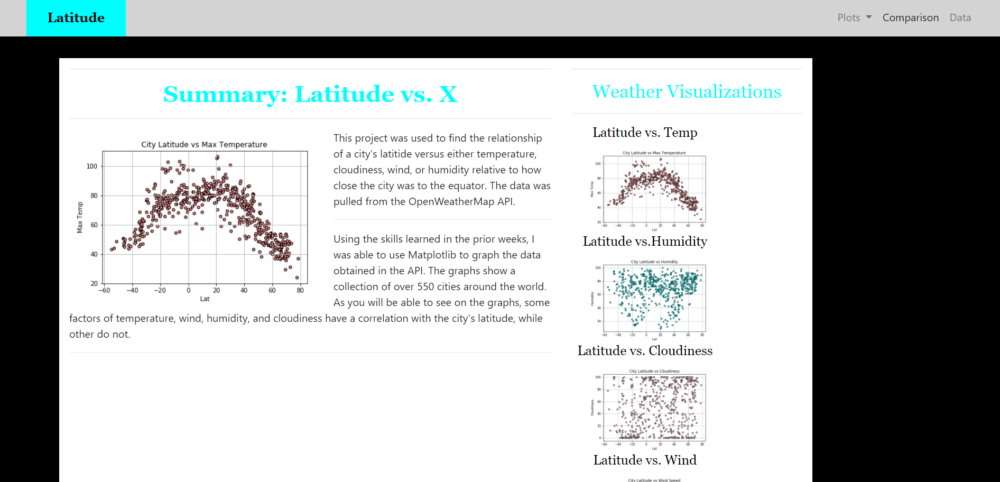
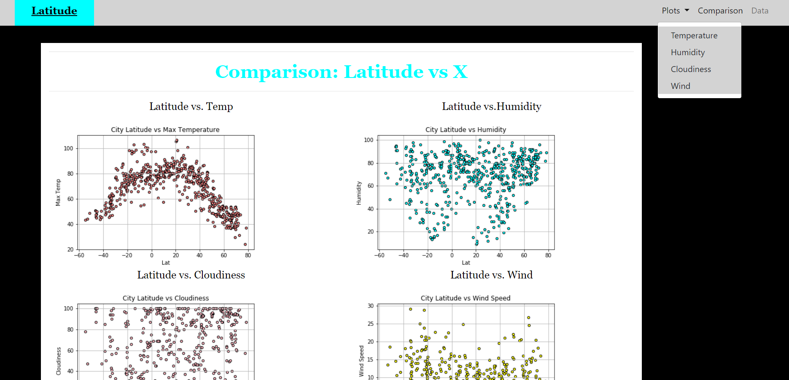

# Web-Design-Challenge

Checkout the Website below:
[https://tnatoli29.github.io/Web-Design-Challenge/](https://tnatoli29.github.io/Web-Design-Challenge/)

In this Challenge I was able to design my own website using HTML and a previous project I did based on weather conditions around the world. 
I used HTML along with bootstrap to build the website.

Below is a link the data used:
[Python-API-Challenge](https://github.com/tnatoli29/Python-API-Challenge)

Below are Images from the website, the first show the Home page and the second shows the Comparison page with the drop down menu. 

